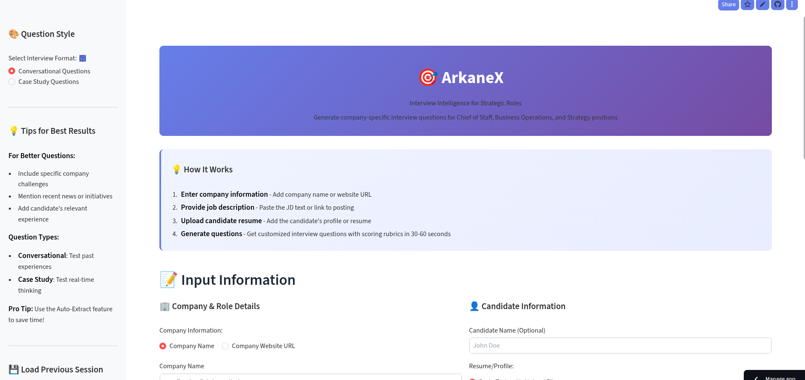

# ArkaneX

**AI-powered interview practice tool for Chief of Staff, BizOps, and Strategy roles — analyzes your resume against the JD, generates company-specific questions, evaluates your answers with STAR coaching, and tracks improvement over retries.**

Paste a job description and your resume → get a gap analysis showing exactly where you're strong and where you'll get tested → practice answering questions one at a time with real-time AI feedback → see a scorecard with competency heatmap and improvement suggestions.



**[Try the Live Demo →](https://arkanex-ai-interviewer.streamlit.app/)**

---

## How It Works

```
Resume + JD + Company
        │
        ▼
┌──────────────────┐     ┌──────────────────┐     ┌──────────────────┐
│   Gap Analysis   │────▶│ Question Generator│────▶│  Practice Mode   │
│  (Claude Sonnet) │     │  (Claude Sonnet)  │     │  One at a time   │
│                  │     │                   │     │                  │
│ Strengths, gaps, │     │ Company-grounded  │     │ Type your answer │
│ untested areas   │     │ questions + rubric│     │ Get AI feedback  │
└──────────────────┘     └──────────────────┘     └──────────────────┘
                                                          │
                                                          ▼
                                                  ┌──────────────────┐
                                                  │   Evaluation     │
                                                  │  Score + STAR    │
                                                  │  coaching + model│
                                                  │  answer + retry  │
                                                  └──────────────────┘
                                                          │
                                                          ▼
                                                  ┌──────────────────┐
                                                  │   Scorecard      │
                                                  │  Competency map  │
                                                  │  Improvement plan│
                                                  └──────────────────┘
```

## Features

| Feature | Description |
|---------|-------------|
| Gap Analysis | Claude compares your resume against the JD — shows strengths, gaps (with risk levels), untested areas, and specific preparation tips |
| Mock Interview Mode | Questions presented one at a time with progress tracking — no peeking ahead |
| STAR Coaching | Each answer evaluated for Situation, Task, Action, Result — missing elements flagged with specific coaching |
| Answer Evaluation | Claude scores each answer (1-5) against the rubric — strengths, improvements, red flags matched |
| Model Answers | For any answer below Excellent, Claude generates an ideal response showing structure and depth expected |
| Retry Tracking | Retry any question and see improvement: "Attempt 1: Needs Work (1/5) → Attempt 2: Good (4/5)" |
| Competency Heatmap | Scores mapped across competencies: stakeholder management, analytical thinking, leadership, execution, communication — visual bar chart |
| Interview Timer | Optional 1-5 minute countdown per question to practice conciseness under pressure |
| Two Question Modes | Conversational behavioral or scenario-based case studies |
| Auto-Scrape | Paste a company URL or job posting link — context extracted automatically |
| Resume Parsing | Upload PDF or DOCX resumes — text extracted and fed into analysis |
| PDF Export | Professional formatted PDF with cover page, rubrics, and branding |
| Session Save/Load | Export session as JSON, reload later to continue |

## Practice Flow

1. **Input** — Enter company info, paste the job description, upload your resume
2. **Gap Analysis** — See your fit score (X/10), strengths with evidence, gaps with risk levels, untested areas with preparation tips
3. **Practice Mode** — Answer questions one at a time. Optional countdown timer for pressure training
4. **Get Feedback** — Each answer scored against the rubric. STAR framework assessment for behavioral questions. Specific coaching on what to improve
5. **Model Answers** — See what an excellent response looks like for any question you didn't ace
6. **Retry** — Redo any question. Track your improvement across attempts
7. **Scorecard** — Overall score, competency heatmap, per-question breakdown, top 3 improvement areas

## Project Structure

```
├── app.py             # Full application (UI, scraping, gap analysis, generation,
│                      #   practice mode, evaluation, scoring, export)
├── SETUP.md           # Detailed setup and feature documentation
└── requirements.txt
```

## Quickstart

```bash
git clone https://github.com/AAP67/arkanex.git
cd arkanex
pip install -r requirements.txt
```

Add your API key to `.streamlit/secrets.toml`:

```toml
ANTHROPIC_API_KEY = "sk-ant-your-key-here"
```

```bash
streamlit run app.py
```

Click **"🎯 Try Demo"** to see it in action with pre-filled Anthropic Chief of Staff data.

**Stack:** Streamlit · Claude Sonnet 4 (Anthropic) · BeautifulSoup · ReportLab (PDF) · PyPDF2

## Built By

**[Karan Rajpal](https://www.linkedin.com/in/krajpal/)** — UC Berkeley Haas MBA '25 · LLM Validation @ Handshake AI (OpenAI/Perplexity) · Former 5th hire at Borderless Capital
